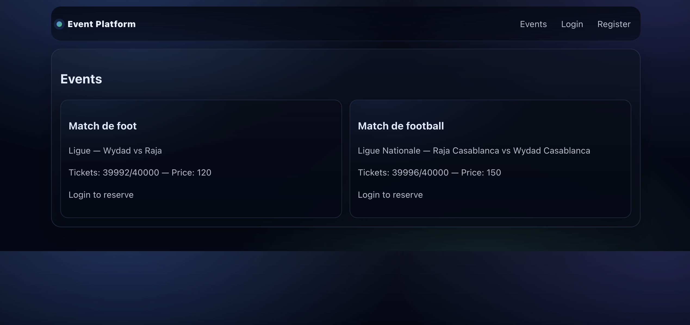
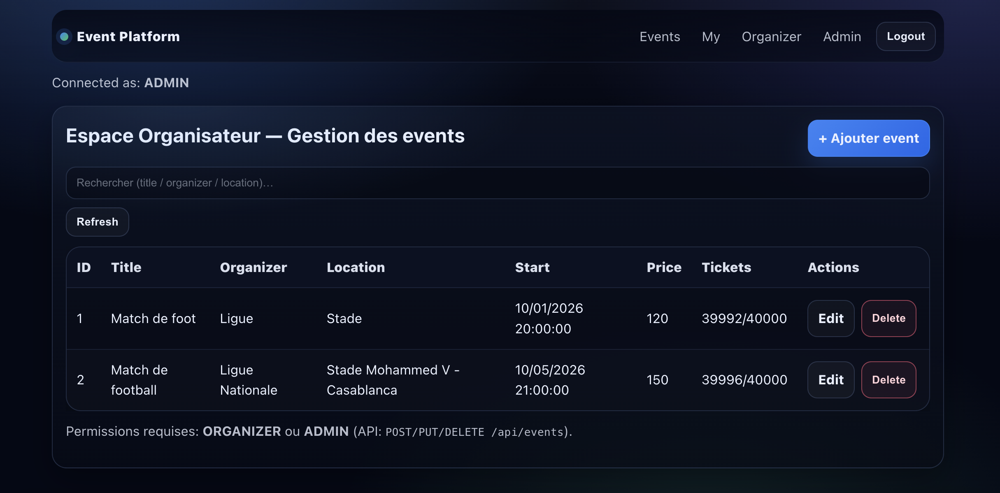
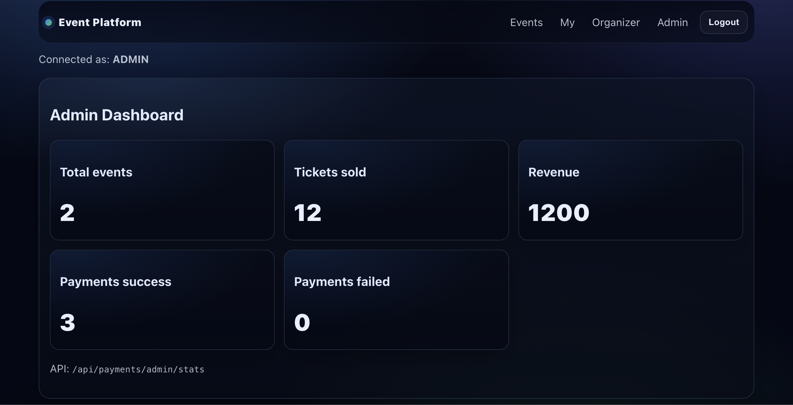
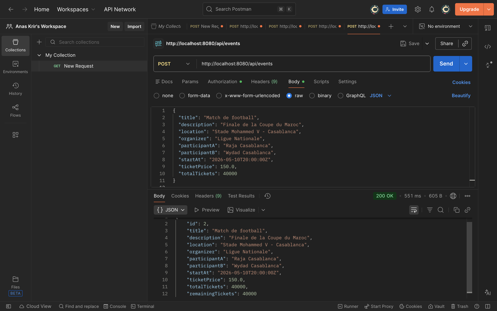
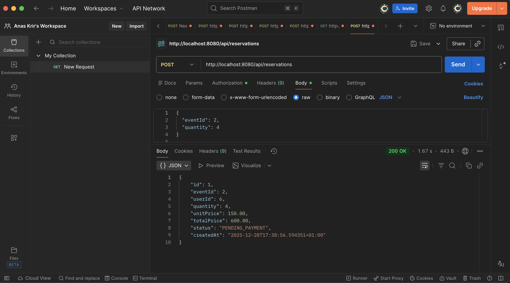

# 🎟️ Event Platform MS — Plateforme de gestion d’événements (Microservices Spring Cloud + React)


**Event Platform MS** est une plateforme complète (backend **microservices**) + frontend **React** pour :
- publier et gérer des événements,
- réserver des tickets,
- initier des paiements,
- centraliser l’accès via un **API Gateway**,
- découvrir les services via **Eureka**,
- externaliser la configuration avec **Spring Cloud Config**.

> ⚠️ **Important** : dans mon environnement, **Docker Compose n’est pas stable** (ports occupés / timing / dépendances).
> Ce README décrit le **démarrage manuel** des services dans l’ordre recommandé ✅

---

## 📌 Sommaire

1. [Architecture](#-architecture-(diagramme-as-code))
2. [Architecture micro-services](#-Architecture-micro-services)
3. [Services & ports](#-services--ports)
4. [Prérequis](#-prérequis)
5. [Configuration (fichiers .env / config)](#-configuration-fichiers-env--config)
6. [Démarrage sans Docker Compose (ordre obligatoire)](#-démarrage-sans-docker-compose-ordre-obligatoire)
7. [Frontend (React)](#-frontend-react)
8. [API (routes principales)](#-api-routes-principales)
9. [Vérifications rapides](#-vérifications-rapides)
10. [Dépannage](#-dépannage)
11. [Aperçu (screenshots)](-Aperçu-(screenshots))
12. [Tests POSTMAN](-Tests-POSTMAN)
13. [Auteurs](#-auteurs)
14. [Licence](#-licence)

---

## 🧩 Architecture (diagramme-as-code)

```
             ┌────────────────────┐
             │  Config Server     │
             │  :8888             │
             └─────────┬──────────┘
                       │ (configs)
                       v
┌────────────────────┐ registers ┌────────────────────┐
│ Eureka Server │<────────────│ Microservices │
│ :8761 │────────────>│ (User/Event/...) │
└─────────┬──────────┘ discovery └─────────┬──────────┘
│ │
│ │ DB access
v v
┌────────────────────┐ ┌────────────────────┐
│ API Gateway │──────────────>│ MySQL │
│ :8080 │ │ :3306 (local) │
└─────────┬──────────┘ └────────────────────┘
│
v
┌────────────────────┐
│ Frontend React │
│ :5173 (local) │
└────────────────────┘
```

---


## Architecture micro-services (schéma)

| Architecture               | 
|----------------------------|
|  | 


---

## 🧱 Services & ports

| Service | Rôle | Port |
|--------|------|------|
| **Config Server** | Centralise les configurations Spring | **8888** |
| **Eureka Server** | Service Discovery (registre) | **8761** |
| **API Gateway** | Point d’entrée unique (routing) | **8080** |
| **User Service** | Auth / Users / rôles | **8081** |
| **Event Service** | CRUD événements | **8082** |
| **Reservation Service** | Réservations / tickets | **8083** |
| **Payment Service** | Paiements | **8084** |
| **Notification Service** | Notifications (email/log) | **8085** |
| **Frontend** | UI React | **5173** |

---

## ✅ Prérequis

### Backend
- **Java 17**
- **Maven** (ou `./mvnw`)
- **MySQL 8.x** (local)  
  ou MySQL via Docker (optionnel)

### Frontend
- **Node.js 20+**
- **npm** (ou pnpm/yarn)

---

## 🔐 Configuration (fichiers .env / config)

### 1) Base de données MySQL (local)
Crée une base (ex : `event_platform`) et un utilisateur :

- Host: `localhost`
- Port: `3306` (ou `3307` si 3306 est déjà pris)
- DB: `event_platform`
- User: `root` ou un user dédié
- Password: (ton mot de passe)

> Si tu utilises MySQL via Docker, pense au **port mapping** (souvent `3307->3306`) pour éviter le conflit avec un MySQL déjà installé.


### 2) Config Server (important)
Le Config Server doit savoir **où trouver** les fichiers de configuration des microservices. <br/>

✅ Deux approches courantes : <br/>
- **Git repo** (recommandé en prod) <br/>
- **Native/local** (simple en local) <br/>

Dans tous les cas, l’objectif est que chaque service récupère sa config depuis :
`http://localhost:8888` <br/>

---

## 🚀 Démarrage sans Docker Compose (ordre obligatoire)

> Lance chaque service dans un **terminal séparé**.  
> Attends que chaque service soit **UP** avant de passer au suivant.

### 0️⃣ (Optionnel) Démarrer MySQL via Docker (si tu n’as pas MySQL local)
```
docker run --name event-mysql \
  -e MYSQL_ROOT_PASSWORD=root \
  -e MYSQL_DATABASE=event_platform \
  -p 3307:3306 \
  -d mysql:8.4
```

### 1️⃣ Config Server (8888)
```
cd config-server
./mvnw spring-boot:run
# ou
mvn spring-boot:run
```
✅ Vérifie : <br/>

- http://localhost:8888/actuator/health <br/>

### 2️⃣ Eureka Server (8761)
```
cd eureka-server
./mvnw spring-boot:run
```
✅ Vérifie : <br/>

- Dashboard Eureka : http://localhost:8761 <br/>

### 3️⃣ API Gateway (8080)
```
cd api-gateway
./mvnw spring-boot:run
```

✅ Vérifie : <br/>

- http://localhost:8080/actuator/health (si Actuator activé) <br/>
- ou teste une route gateway (voir section API) <br/>

### 4️⃣ User Service (8081)
```
cd user-service
./mvnw spring-boot:run
```

### 5️⃣ Event Service (8082)
```
cd event-service
./mvnw spring-boot:run
```

### 6️⃣ Reservation Service (8083)

```
cd reservation-service
./mvnw spring-boot:run
```

### 7️⃣ Payment Service (8084)
```
cd payment-service
./mvnw spring-boot:run
```

### 8️⃣ Notification Service (8085)
```
cd notification-service
./mvnw spring-boot:run
```

**✅ À ce stade, ouvre Eureka : http://localhost:8761 <br/>
Tu dois voir tes services enregistrés (UP).** <br/>

---

## 🖥️ Frontend (React)

**_Installation : <br/>_**
```
cd frontend
npm install
```

**_Démarrage : <br/>_**

```
npm run dev
```

➡️ Ouvre : <br/>

- http://localhost:5173 <br/>

> Si ton frontend est configuré pour appeler le backend via Gateway :
Base URL = http://localhost:8080

---

## 🔁 API (routes principales) 

Base URL (via Gateway) :<br/>

- http://localhost:8080 <br/>

**_Events (exemples) <br/>_**

✅ POST /api/events <br/>
✅ PUT /api/events/{id} <br/>
✅ DELETE /api/events/{id} <br/>
✅ GET /api/events  <br/>

**_Users (exemples) <br/>_**

✅ POST /api/auth/register <br/>
✅ POST /api/auth/login <br/>
✅ GET /api/users/me <br/>

**_Reservations / Payments <br/>_**

✅ POST /api/reservations <br/>
✅ POST /api/payments <br/>

> Les routes exactes peuvent dépendre de ton api-gateway (routes spring.cloud.gateway.routes).

---


## ✅ Vérifications rapides

**_1) Eureka_**

- http://localhost:8761 <br/>
Tu dois voir : USER-SERVICE, EVENT-SERVICE, ... <br/>

**_2) Config Server_** <br/>

- http://localhost:8888/actuator/health <br/>

**_3) Gateway_** <br/>

- http://localhost:8080 <br/>

**_4) Logs_** <br/>

Si un service ne se lance pas : <br/>
```
# voir les logs en console
# ou ajouter -Ddebug si nécessaire
./mvnw spring-boot:run -Dspring-boot.run.arguments=--debug
```

---


## 🧯 Dépannage

### ❌ “Port already in use” <br/>
**_✅ Solutions : <br/>_**

> changer le port dans ton application.properties
> ou tuer le process qui occupe le port :
```
lsof -i :3306
kill -9 <PID>
```
> Ou utiliser MySQL Docker en 3307->3306.

### ❌ Un service ne récupère pas la config <br/>

- Cause fréquente : Config Server pas démarré, ou mauvaise URL.
> Vérifie que chaque service pointe vers : <br/>

- spring.config.import=optional:configserver : http://localhost:8888 <br/>
- ou spring.cloud.config.uri = http://localhost:8888 <br/>

### ❌ Eureka ne voit pas les services

✅ Vérifie : <br/>

- Eureka est UP <br/>

- les services ont : <br/>
  - eureka.client.serviceUrl.defaultZone=http://localhost:8761/eureka <br/>

### ❌ Gateway renvoie 404

✅ Vérifie les routes du Gateway :

- config spring.cloud.gateway.routes <br/>
- noms de services (ex : lb://EVENT-SERVICE) <br/>

---

## 🖼️ Aperçu (screenshots)


| Home (Events)      | Edit Events          | Dashboard Admin         |
|--------------------|----------------------|-------------------------|
|  |  |  |

---

## Tests POSTMAN :


| Events          | Reservation     | Payment         |
|-----------------|-----------------|-----------------|
|  |  |  |


---

## 👥 Auteurs

Anas KRIR — Microservices, Spring Cloud, API Gateway, Docker, intégration globale <br/>
Adam EL YOURI — Frontend React, UI/UX, intégration API, dashboards <br/>
Ismail MACHHOUR — Microservices, Payment Service, intégration backend <br/>
Mohamed Taha MALLOUK — Microservices, User Service, intégration backend <br/>

---

## 📄 Licence

Projet sous licence MIT. <br/>
✅ Libre d’utilisation, modification et distribution. <br/>

© 2025 — KRIR Anas & EL YOURI Adam & MACHHOUR Ismail & MALLOUK Mohamed Taha <br/>

---